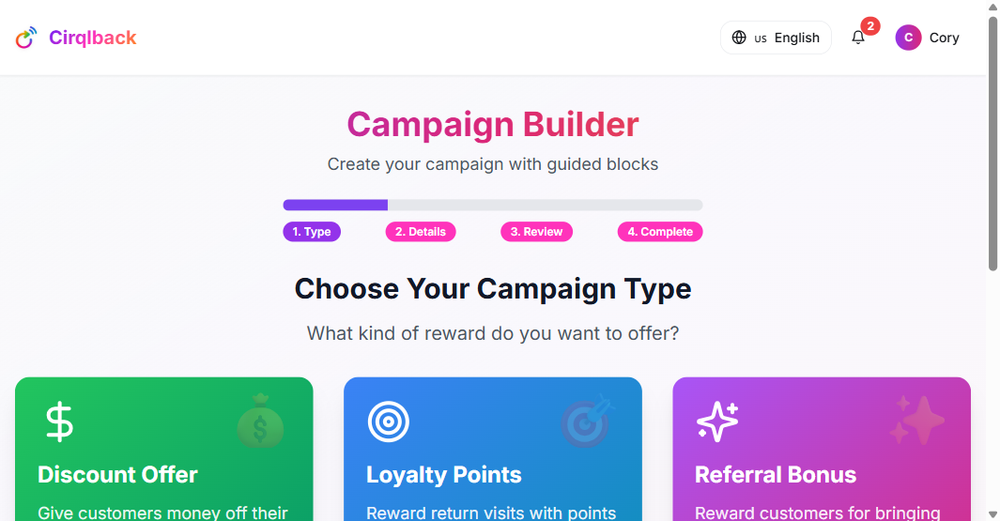
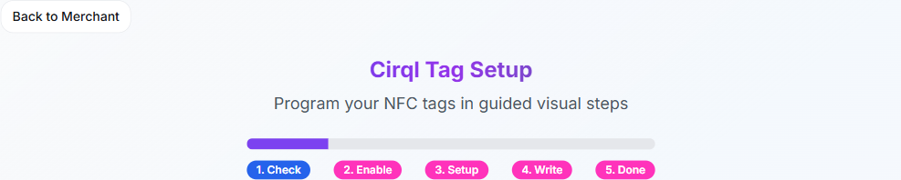
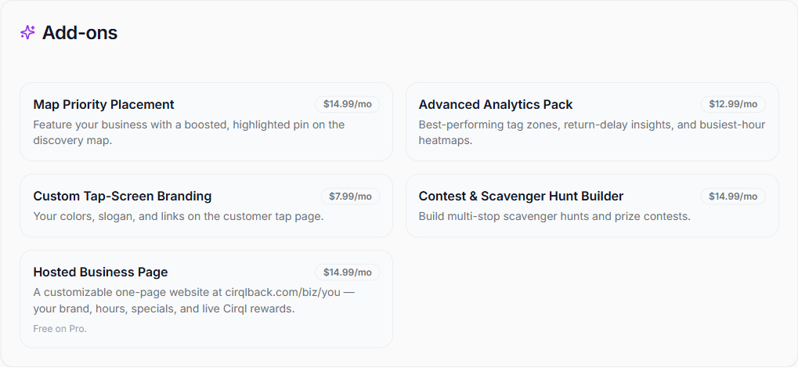
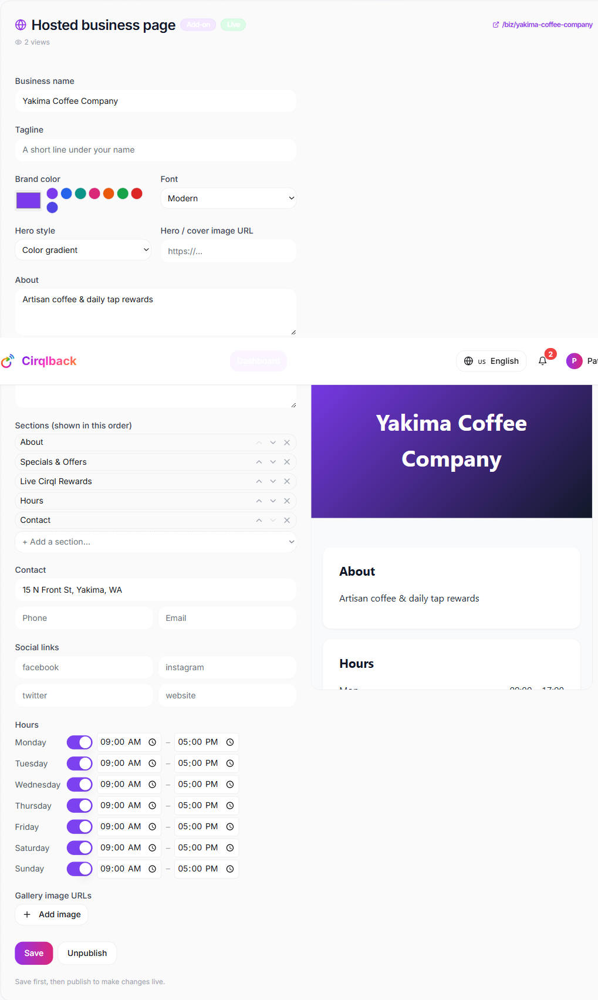
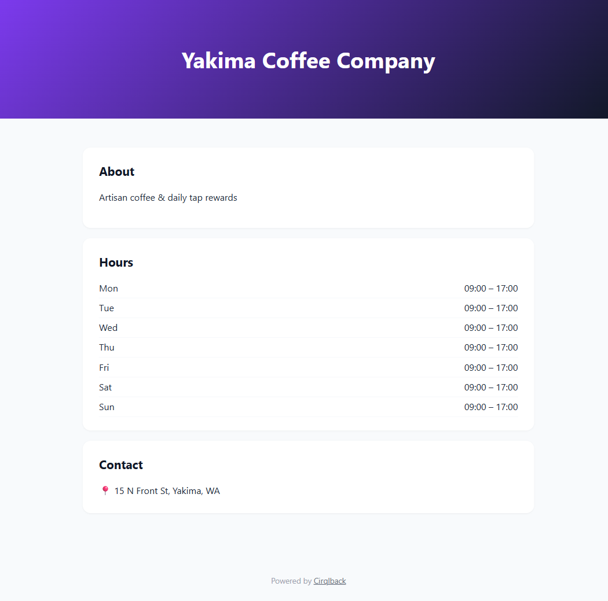

# Cirqlback — Business Guide (Core Plan)

**For:** single‑location local businesses running loyalty with Cirqlback on the **Core ($19.99/mo)** plan — or the free **Starter** 6‑month trial.
**Log in at:** `/auth` · **Your dashboard:** `/merchant`

> **This is your complete how‑to for running your business on Cirqlback** — from first sign‑in to daily operations. Everything a Core account can do is covered here, in the order you'll actually do it. Need more locations, unlimited taps, or the hosted page included free? See the **[Pro Guide](./business-pro-guide.md)**.

---

## Quick start — your first live reward in ~15 minutes

1. **Create your account** at `/auth` → sign up as a **Business**.
2. **Fill in your business profile** (name, address, hours) — this also puts your pin on the Discovery Map.
3. **Create a campaign** — e.g. a "Buy 5, get 1 free" loyalty card (§2).
4. **Set up a Cirql tag** and link it to that campaign (§3).
5. **Place the tag** on your counter and **tap it with your phone** to test.
6. Watch the first taps land in **Analytics** (§6).

That's the whole loop. The rest of this guide goes deeper on each step and on growing from there.

---

## 1. Set up your business

1. Go to **`/auth`** and choose **Create an account** → sign up as a **Business**.
2. Sign in and open your **Business Hub** at **`/merchant`** — this is your control center.
3. Open **Settings** (`/settings`) and complete your **business profile**:
   - **Name, category, description**
   - **Address** — places you on the **Discovery Map** so customers can find you
   - **Hours, phone, email, logo**

> Your profile does double duty: it feeds both your **map pin** and your **hosted business page** (§4). Fill it in once, thoroughly, and both look great.

**Your plan at a glance (Core):**

| | Core |
|---|---|
| Business locations | 1 |
| Campaigns | Unlimited |
| Customer taps / month | 500 |
| Cirql tags included | 20 |
| Analytics | Tap & redemption analytics |
| Hosted business page | Add‑on ($14.99/mo) |
| Support | Email |

---

## 2. Create your rewards (campaigns)

A **campaign** is the rule behind a reward. From the Business Hub, click **Create Campaign** to open the guided **Campaign Builder** (Type → Details → Review → Complete).

**Pick a type:**

- **Discount Offer** — money off a purchase (e.g. "10% off," "$5 off orders $25+").
- **Loyalty Points** — reward return visits. Set a **tap goal** (e.g. 5) to make it a **punch card**: the reward unlocks every Nth tap.
- **Referral Bonus** — reward customers for bringing friends.

Then give it a **name** and **reward** (e.g. "Free coffee"), set a value if relevant, optionally require **GPS proximity**, and finish. Your campaign is **live** immediately and ready to attach to a tag.

> Campaigns are private to you — only your business can edit or delete its own campaigns.

---

## 3. Set up your Cirql tags

A **Cirql tag** is an NFC sticker or stand at your counter that customers tap to earn. From the Business Hub, click **Program Tag** to open the **Cirql Tag Setup** wizard.

1. **Label the tag** (e.g. "Front counter," "Patio") so your analytics show which spots perform best.
2. **Link it to a campaign** from §2.
3. **Write it to a physical NFC tag.** Programming is done on an **NFC‑capable Android phone** — hold the blank tag to the back of the phone when prompted. On a device without NFC, use the **Smart NFC Writer** option or the printable **QR code** as a backup.
4. **Place the tag** where customers naturally pause, and **tap it with your own phone** to confirm it works.

You can **rename, re‑point, or deactivate** your own tags anytime, and each tag tracks its own tap count.

---

## 4. Launch your hosted business page

Give customers a polished one‑page website — your brand, hours, specials, and your **live Cirql rewards** — hosted at **`cirqlback.com/biz/your-business`**. No web skills needed.

> On **Core**, the Hosted Business Page is a **$14.99/mo add‑on**. (It's **included free on Pro**.)

**Step 1 — Turn it on.** In the **Add‑ons** panel on your Business Hub, find **Hosted Business Page** and purchase it through secure checkout. It activates automatically.

**Step 2 — Make it yours.** The **Hosted business page** editor appears on your Hub. Customize with simple controls — no layout can break:

- **Brand color** (pick any color or a swatch) and a **font** style
- A **hero** style and optional cover **image**
- **About** and **Specials** text
- Turn sections **on/off and reorder** them (About, Specials, Live Cirql Rewards, Hours, Gallery, Contact, Social)
- **Hours**, **contact**, **social links**, and a **photo gallery**

A **live preview** updates as you type.

**Step 3 — Publish.** Click **Save**, then **Save & publish**. You'll get your public link (**`/biz/your-business`**) and a view counter. Your active campaigns appear automatically in the **Live Cirql Rewards** section — publish once and they stay current.

> Share your `/biz/...` link on Google, Instagram, and printed materials. To take it down, open the editor and click **Unpublish**.

---

## 5. Run the daily loyalty loop

Once tags are live, the loop runs itself:

- Customers **tap → earn** automatically — nothing to do per tap.
- When a customer completes a punch card or earns a discount, they show a **reward code**.
- **Redeem it:** look the code up in your dashboard and mark it redeemed. A redeemed code can't be reused.

**Anti‑abuse is built in:** a per‑tag cool‑down, optional GPS proximity, and device fingerprinting stop rapid repeat taps, so the punch card can't be gamed.

---

## 6. Watch your numbers (analytics)

Open **Analytics** (`/analytics`) for real figures from your taps and redemptions:

- **Total taps**, **active customers**, **rewards issued vs redeemed** (conversion rate)
- **Busiest hours** and your **peak window**
- **Top campaigns** and **top tag locations**
- A **recent‑activity** feed of the latest taps and redemptions

**Enter your sales data** in the dashboard to unlock accurate revenue, average‑order, and Cirql‑driven‑sales metrics.

> Want deeper insight — best tag zones, return‑visit timing, heatmaps? That's the **Advanced Analytics** add‑on (§8).

---

## 7. Keep customers coming back

- **Favorites & reminders:** customers can favorite your shop. From the **Reminders** panel, send them a nudge or offer ("Your card's almost full!"). It shows in their in‑app feed.
- **Your tap screen:** by default it shows your business name and offer. Want your **colors, logo, slogan, and links** on it? That's the **Custom Tap‑Screen Branding** add‑on (§8).

---

## 8. Optional upgrades (add‑ons)

Add‑ons are per‑business monthly upgrades you buy from the **Add‑ons** panel. Available on any paid plan:

| Add‑on | Price/mo | What it does |
|---|---|---|
| **Custom Tap‑Screen Branding** | $7.99 | Your colors, logo, slogan & links on the customer tap page. |
| **Advanced Analytics Pack** | $12.99 | Best‑performing tag zones, return‑visit timing, busiest‑hour heatmaps. |
| **Map Priority Placement** | $14.99 | A boosted, highlighted pin on the discovery map. |
| **Contest & Scavenger‑Hunt Builder** | $14.99 | Build multi‑stop scavenger hunts and prize contests. |
| **Hosted Business Page** | $14.99 | Your customizable one‑page website at `/biz/you` (§4). *Free on Pro.* |

Buying an add‑on runs through secure checkout and activates automatically once payment succeeds.

---

## 9. Team up: group & neighborhood campaigns

You can **join open multi‑store campaigns** so your shop is part of a "tap at 3 shops" trail — a great way to share foot traffic with neighbors. Find joinable campaigns in the **group‑campaigns** panel on your Business Hub.

---

## 10. Billing & your account

- See your plan and tier under **Account** (`/account`).
- **Upgrade to Pro** or buy add‑ons at **Checkout** (`/checkout`). Payments are processed securely by **Stripe** — Cirqlback never sees your card number, and the price is set server‑side, so you're always charged the correct amount.
- On the **Starter** trial you may be offered a discounted rate to convert before the trial ends.

**Core limits & when to upgrade:** Core covers **1 location** and **500 taps/month**. If you add locations, outgrow the tap allowance, or want the hosted page and priority support included, **[move to Pro](./business-pro-guide.md)**.

---

## 11. Troubleshooting & FAQ

**A customer says their reward won't work.** Check the code's status — it may already be **redeemed** or **expired**.

**Can customers cheat the punch card?** No — per‑tag cool‑down, optional GPS proximity, and device fingerprinting prevent rapid repeat taps.

**Do customers need an account?** No. They're anonymous unless they share an email to save progress.

**Where should I place tags?** Anywhere customers naturally pause — the register, the table, the exit. Label each so analytics show which spots perform best.

**My hosted page isn't showing.** Make sure you clicked **Save & publish** (not just Save), and that the Hosted Business Page add‑on is active. An unpublished or lapsed page returns a "not available" message.

**How do I get more taps or locations?** Upgrade to **Pro** (3 locations, unlimited taps, 50 tags, hosted page included, priority support).

---

## 12. Your weekly rhythm

A simple checklist to keep the loop healthy:

- **Daily:** redeem reward codes as customers present them.
- **Weekly:** glance at Analytics — which tag spot and campaign are winning? Adjust placement or offers.
- **Weekly:** send one Reminder to favoriters (a fresh offer or "almost full" nudge).
- **Monthly:** refresh your hosted page specials, and review whether an add‑on (or Pro) would pay for itself.

---

*Need the bigger toolkit — multiple locations, unlimited taps, the hosted page included, contests, and multi‑store campaigns? See the **[Pro Guide](./business-pro-guide.md)**.*
