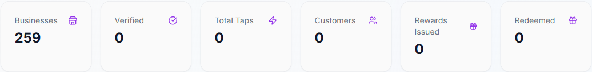
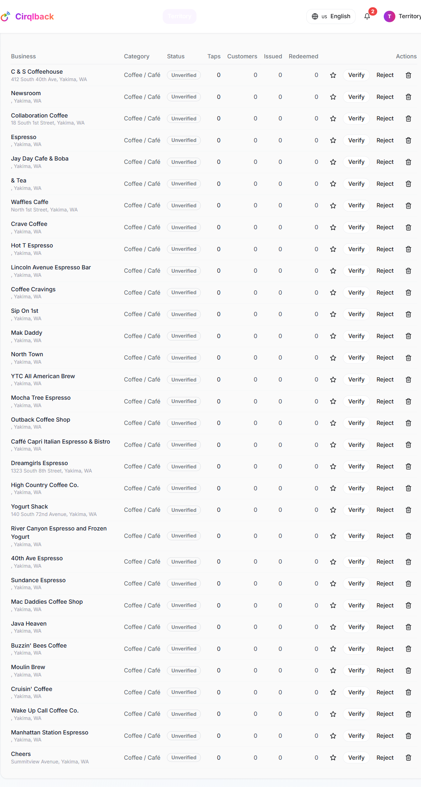
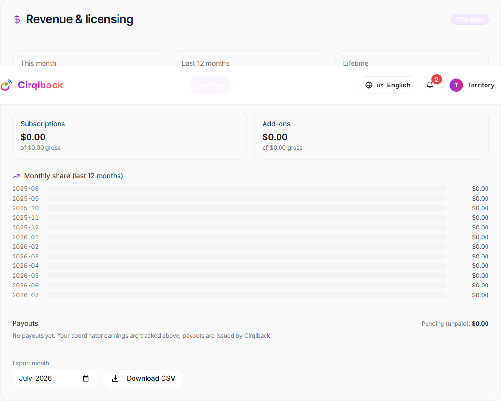

# Cirqlback — Community Coordinator Guide

**For:** Community Coordinators — the local partners who grow and manage Cirqlback in a city or region, onboard businesses, run area‑wide campaigns, and earn a **revenue share**.
**Log in at:** `/auth` · **Your dashboard:** **`/coordinator`**

> **Getting your account:** Coordinators are set up by a Cirqlback administrator (there's no public sign‑up). Once your account exists, log in at `/auth` and you'll see the **Territory** area in your navigation. This guide is your complete playbook for running your territory as a business.

---

## Quick start — your first week

1. **Open your dashboard** at `/coordinator` and review your **territory overview** (§2).
2. **Work your prospect list** — your territory is pre‑seeded with local leads. Search, review, and cull the ones that don't fit (§3).
3. **Onboard and verify** your first businesses (§3).
4. **Launch a region campaign** and **feature** a standout shop on the map (§4).
5. **Check Revenue & licensing** to see how your share accrues (§6).

---

## 1. Your role in one minute

You're the boots‑on‑the‑ground owner of a **territory** (a city/region). You:

- **Recruit and onboard** local businesses onto Cirqlback.
- **Verify** businesses and keep your territory list clean.
- Run **region‑wide, multi‑store campaigns** and control what's featured on the map.
- Provide local support and set **regional welcome messages and offers**.
- **Earn a share** of the subscription and add‑on revenue from the businesses in your territory.

---

## 2. The Coordinator Dashboard (`/coordinator`)

When you sign in, your dashboard shows a **territory overview** — live totals for your region: businesses, verified businesses, taps, active customers, and rewards issued/redeemed.

Below it you'll find **business management**, a **multi‑store campaign builder**, **templates & regional tools**, and your **Revenue & licensing** panel. Everything is **scoped to your territory** — you only ever see and manage your own region.

---

## 3. Onboarding & managing businesses

Your territory comes pre‑seeded with **prospects** — real local businesses (unclaimed, unverified, and hidden from the public map) for you to work through. The **Businesses in your territory** table is your command center.

**Find a business fast.** Use the **search box** to filter the table by **name, category, or address** — handy when your list runs long.

**Onboard a business.** In **Onboard a business**, pick a **store template** (Café, Restaurant, Retail) to prefill sensible defaults, enter the name, choose the territory, and click **Onboard**. New businesses start **unverified**.

**Verify or reject.** Review each business and mark it **Verified** (a legitimate, active local shop) or **Rejected**.

**Feature on the map.** Toggle the **star** to feature a shop — featured businesses float to the top of the Discovery Map with a highlighted marker. Use it to spotlight new or seasonal businesses.

**Cull prospects.** For an **unclaimed** prospect that doesn't fit, click the **trash icon** to remove it from your list. (Claimed businesses — ones with a real owner — can't be removed this way.)

> Everything is scoped to your territory — attempts to touch a shop outside your region are blocked. Businesses you onboard can also run their own **hosted page** and campaigns; see the Business guides.

---

## 4. Region‑wide, multi‑store campaigns

Your **campaign builder** creates group campaigns that span several stores in your territory — the "Coffee Loop," "Tap Trail," or "Taste Tour" style experiences:

1. Open **Multi‑store campaigns → New**.
2. Set the **rule** (e.g. *tap N of M stores*, or *all stores*), the **required stops**, and the **reward**.
3. Pick the member stores from your territory.
4. Publish. The campaign appears on the **Discovery Map** as a **Group Trail**, and customers' cross‑store progress is tracked automatically.

**Map placement control:** you can **feature** a store or a campaign on the map. Featured shops float to the top with a highlighted marker, and featured trails get a badge — use this to spotlight new businesses, seasonal events, or scavenger routes.

---

## 5. Templates & regional tools

- **Campaign templates** — apply a ready‑made campaign (e.g. *Summer Loyalty*, *Scavenger Hunt*, *Holiday Bonus*) to **all your stores at once** with a click.
- **Regional welcome message** — set a default welcome shown to new businesses in your territory.
- **Discount & trial codes** — issue regional offer codes (percent, fixed, or trial) scoped to your territory. Codes are unique; the system prevents duplicates.

---

## 6. Revenue & payouts

This is how you get paid.

**Your share.** You earn a **percentage of gross revenue** — both **subscriptions and add‑ons** — from businesses in your territory. The default is **70%** (you) / **30%** (platform); an administrator can set your rate anywhere from **50% to 100%**. Your dashboard shows your current **share %**.

**The panel shows:**

- **This month**, **last 12 months**, and **lifetime** earnings (your share, plus gross and charge counts).
- A **subscription vs add‑on** breakdown and a **12‑month trend**.
- Your **unpaid (pending)** balance and a list of **payouts** with their status.
- A **CSV export** (one month or all) — one row per charge with date, business, source, plan/description, gross, share %, and your share.

**How payouts work.** Payouts are **reporting‑based**: an administrator periodically **generates a payout** from your unpaid earnings and marks it **paid** once the money is sent. Each earning row **snapshots your share rate at the time of the charge**, so a later rate change never affects past earnings.

---

## 7. A day‑in‑the‑life checklist

- ☐ Check your **territory overview** for new activity and taps.
- ☐ **Search and cull** your prospect list; **verify** newly onboarded businesses.
- ☐ Onboard a new shop or two (use a template to move fast).
- ☐ Refresh or launch a **region campaign**; feature a standout shop on the map.
- ☐ Issue a **regional offer code** for a local event.
- ☐ Review your **earnings** and export a CSV at month‑end.

---

## 8. FAQ

**Can I see other coordinators' regions?** No — you only see and manage your own territory.

**Who sets my revenue share?** An administrator; the default is 70% and it can be set 50–100%. It applies to future earnings only.

**When do I get paid?** Payouts are generated and marked paid by an administrator from your unpaid balance; track them in your Revenue panel.

**What are the prospects already in my list?** Pre‑seeded local leads for you to work — unclaimed, unverified, and off the public map until you verify or a real owner claims them.

**Can I onboard a business in another city?** Only within a territory you manage. If you expand, an admin can assign you additional territories.

**How do businesses I onboard get charged?** Through Cirqlback's standard secure (Stripe) checkout — and your share of those charges is attributed to you automatically.

---

*Questions about the platform itself go to your Cirqlback administrator — see the **[Admin Guide](./admin-guide.md)**.*
